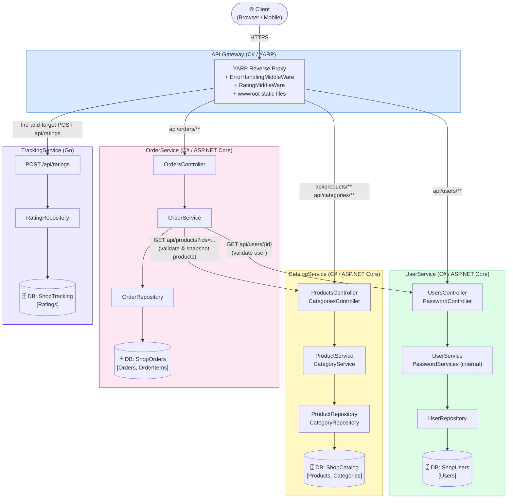

# WebApiShop Microservices Separation Plan

## Overview
Split the monolithic WebApiShop ASP.NET Core API into 4 microservices with synchronous HTTP calls for cross-service communication. Each service owns its data, exposes a REST API, and calls sibling services directly when needed. An API Gateway routes external traffic.

## Language Selection Per Microservice

| Microservice | Language / Framework | Reason |
|---|---|---|
| **API Gateway** | C# / ASP.NET Core + YARP | YARP is a Microsoft-native reverse proxy built for .NET — zero friction with the existing middleware patterns (`ErrorHandlingMiddleWare`, static files). Keeps the gateway in the same ecosystem as most services. |
| **UserService** | C# / ASP.NET Core | Security-critical service benefits from .NET's mature identity and JWT libraries. The existing `PasswordServices` uses `zxcvbn-core` (a .NET library), avoiding a rewrite. EF Core handles `User` table mapping already in place. |
| **CatalogService** | C# / ASP.NET Core | Read-heavy query service (search, filter, pagination) that already has working EF Core LINQ queries with `.Include(Category)`. Staying in C# preserves existing logic and team expertise. |
| **OrderService** | C# / ASP.NET Core | Most transactional and data-integrity-sensitive service — multi-row inserts (`Order` + `OrderItem`s) with cross-service validation. EF Core transactions and typed `HttpClient` with Polly resilience policies are mature and well-supported in .NET. |
| **TrackingService** | Go | Write-heavy, fire-and-forget service receiving a request on every API call. Go is ideal: tiny memory footprint (~5 MB), fast cold starts, excellent concurrency via goroutines, and compiles to a single binary for easy deployment. If the team prefers a single-language stack, C# minimal API is a viable fallback. |

## Pre-requisites (Fix Build Blockers)
1. Resolve merge conflicts in `UserRepository/UserRepository.cs` and `UserServices/UserServices.cs`
2. Fix project reference in `TestProject/TestProject.csproj` — change `Repositories.csproj` to `Repository.csproj`
3. Fix field name mismatch in `WebApiShop/Controllers/ProductsController.cs` — use `_productService` consistently

## Step-by-Step Implementation

### Step 1: Create 4 ASP.NET Core Web API Projects
Each with its own Controller → Service → Repository → DbContext stack and isolated database:
- **UserService**: `User` entity, `PasswordServices` embedded as internal utility
- **CatalogService**: `Product` + `Category` (kept together due to FK + eager `.Include()`)
- **OrderService**: `Order` + `OrderItem`, stores `UserId`/`ProductId` as opaque IDs
- **TrackingService**: `Rating` entity (standalone, no FKs)

### Step 2: Wire Synchronous HTTP Calls in OrderService
- Register typed `HttpClient`s (`IUserApiClient`, `ICatalogApiClient`) via `builder.Services.AddHttpClient<T>()`
- At order creation, call `UserService GET api/users/{userId}` to validate user exists
- Call `CatalogService GET api/products?ids=...` to validate products and snapshot price/name into `OrderItem`
- Return `400 BadRequest` if either service returns `404`
- Add Polly retry/circuit-breaker policies on all `HttpClient` registrations

### Step 3: Refactor Rating Tracking
- Replace the `RatingMiddleWare` (direct DB write) with gateway-level middleware
- Gateway `POST`s request metadata to `TrackingService POST api/ratings`
- Use fire-and-forget call so tracking failures don't block user requests

### Step 4: Add API Gateway (YARP or Ocelot)
- Route `/api/users/**` → UserService
- Route `/api/products/**` + `/api/categories/**` → CatalogService
- Route `/api/orders/**` → OrderService
- Host shared `ErrorHandlingMiddleWare` for uniform error responses
- Serve static frontend files from `wwwroot/`
- Store service base URLs in `appsettings.json`

### Step 5: Extract Shared Contracts
- Move cross-service DTOs (`UserDTO`, `ProductDTO`, `PageResponseDTO`) into a `Contracts` class library
- Split the single `AutoMapper.cs` profile into per-service mapping profiles

### Step 6: Database Per Service
- Split the single `Shop` database into 4 isolated databases
- Each service gets a dedicated slim `DbContext` with only its own `DbSet`s
- Migrate via EF Core scaffolding per service

## Resilience
- Add Polly retry (3× exponential backoff) + circuit-breaker (break after 5 failures) on all `HttpClient` registrations
- Gateway-level timeout policies for downstream calls

## Authentication (Future)
- Add JWT issuance in UserService
- Validate tokens at the API Gateway
- Downstream services receive validated claims principal

## Cross-Service Dependency Map
```
API Gateway
├── → UserService (standalone, embeds PasswordServices)
├── → CatalogService (standalone, Products + Categories)
├── → OrderService
│       ├── HTTP GET → UserService (validate user)
│       └── HTTP GET → CatalogService (validate & snapshot products)
└── → TrackingService (receives fire-and-forget POST from gateway)
```

## Architecture Diagram


